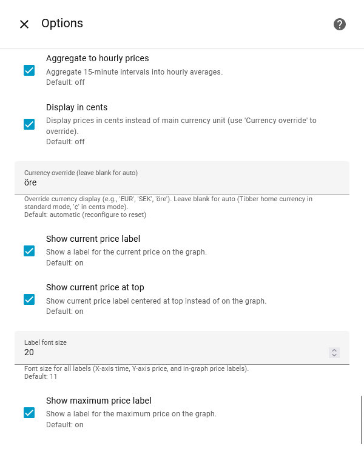
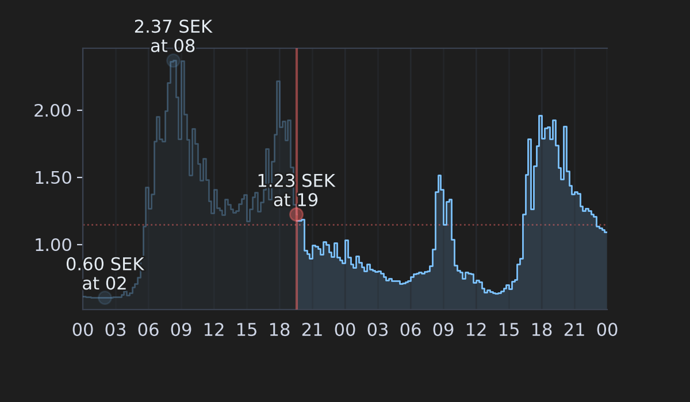
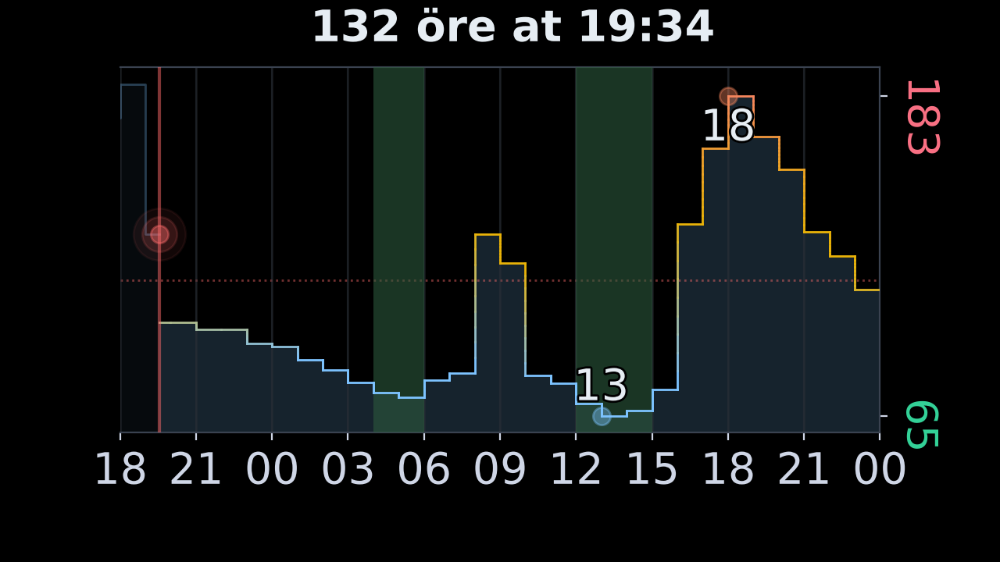

#  Tibber Graph

[](https://github.com/custom-components/hacs)

[](https://tooomm.github.io/github-release-stats/?username=stefanes&repository=tibber-graph)
[](https://github.com/stefanes/tibber-graph/issues)

Display future (and past) electricity prices as a graph in Home Assistant, exposed as a camera entity. **Tibber Graph** was built for the official [Tibber integration](https://www.home-assistant.io/integrations/tibber/), but supports any compatible price sensor as a data source such as [Nord Pool](https://www.home-assistant.io/integrations/nordpool) (see example [below](#nord-pool-official-integration)) or [EPEX Spot](https://github.com/mampfes/ha_epex_spot).


## Installation

### HACS (Recommended)

1. Ensure that [HACS](https://hacs.xyz) is installed
2. Open repository and click **Download** to install
3. Restart Home Assistant

[](https://my.home-assistant.io/redirect/hacs_repository/?owner=stefanes&repository=tibber-graph)

### Manual Installation

1. Copy the `custom_components/tibber_graph` folder into `config/custom_components`
2. Restart Home Assistant

## Configuration

### Data source

You can configure Tibber Graph to get price data from either:

1. **Tibber Integration** (default): Uses the official [Tibber integration](https://www.home-assistant.io/integrations/tibber/) to fetch prices directly. You can [sign up for Tibber](https://tibber.com/se/invite/gqpkcwrn) using the invitation code `gqpkcwrn` to get a **€50/500 kr bonus** for use in the [Tibber Store](https://tibber.com/se/store).

2. **Custom Entity**: Provide any Home Assistant sensor entity that contains price data in its attributes. The entity must have either a `prices` or `data` attribute containing a list of prices with `start_time`|`start`|`startsAt` and `price`|`price_per_kwh`|`total` fields (see [examples](#custom-data-source) and [schema](#schema) below).

> [!NOTE]
> The price data source is selected during setup and **cannot be changed** after creation. If you need to switch between sources, you must create a new integration instance.

### Setup

Configure the **Tibber Graph** integration:

[](https://my.home-assistant.io/redirect/integration/?domain=tibber_graph)

Or:

1. Go to **Settings** → **Integrations**
2. Click **Add Integration**
3. Search for "**Tibber Graph**"

You will now have a `camera.tibber_graph_{entity_name}` entity that displays the Tibber prices as a graph (and an image available at `http://homeassistant.local:8123/local/tibber_graph_{entity_name}.png`).

The integration will appear in **Settings → Devices & Services** with the entity name you provided during setup (or your Tibber home name if no entity name was specified).


### Advanced customization

All configurable options are available through the Home Assistant UI (**Settings → Devices & Services → [Your Entity Name] → Configure**).

Key features include:

- **Multiple graph views**: Create separate camera entities with different configurations
- **Flexible time ranges**: Show all available data or specify a custom hour range
- **Theme customization**: Light and dark themes with full color control
- **Price highlighting**: Highlight the cheapest price periods with colored backgrounds
- **Grid and axis control**: Customize gridlines, axis position, and tick formatting
- **Label options**: Configure min/max/current price labels with colors and positioning

For a complete list of available options, their descriptions, and default values, see **[OPTIONS.md](OPTIONS.md)**.



## Examples

Graph rendered with old defaults (canvas size 1200×700, label current at top disabled, color price line by average disabled):



Graph rendered with custom options (theme: dark (black background), canvas size 1280×720, start graph at: current hour, Y-axis side: right, Y-axis label rotation: 270°, Y-axis tick count: 2, Y-axis tick use colors enabled, cheap price points: 5, use hourly prices enabled, use cents enabled, currency override: öre, label font size: 20, label min/max show price disabled):



Graph rendered with custom options (theme: light, show X-axis ticks enabled, show vertical grid disabled, Y-axis tick count: 3, Y-axis tick use colors enabled, cheap price points: 5, use hourly prices enabled, label minimum price disabled, label maximum price disabled, label current at top disabled, color price line by average disabled):


## Custom data source

Examples of custom data sources that can be used with Tibber Graph (see [schema](#schema) below).

> [!TIP]
> See the [`home-assistant-config`](https://github.com/stefanes/home-assistant-config) repo for more complete examples.

### Tibber (custom price sensor)

Install and configure the official [Tibber integration](https://www.home-assistant.io/integrations/tibber/) and create a template sensor:

```yaml
template:
  - trigger:
      - trigger: time
        at: "14:00:00"
      - trigger: homeassistant
        event: start
    action:
      - action: tibber.get_prices
        data:
          start: "{{ (today_at()).strftime('%Y-%m-%d %H:%M:%S') }}"
          end: "{{ (today_at() + timedelta(days=1)).strftime('%Y-%m-%d %H:%M:%S') }}"
        response_variable: today_prices
      - action: tibber.get_prices
        data:
          start: "{{ (today_at() + timedelta(days=1)).strftime('%Y-%m-%d %H:%M:%S') }}"
          end: "{{ (today_at() + timedelta(days=2)).strftime('%Y-%m-%d %H:%M:%S') }}"
        response_variable: tomorrow_prices
    sensor:
      - name: Tibber price
        state: >
          
          {{ (prices | map(attribute='price') | sum / prices | count)  | round(3, default=0) }}
        device_class: timestamp
        unique_id: tibber_price
        icon: mdi:cash-multiple
        availability: >
          {{ today_prices is mapping and today_prices.prices.values() | first | length > 0 }}
        attributes:
          prices: >
            {{ today_prices.prices.values() | first + tomorrow_prices.prices.values() | first }}
```

### Nord Pool (official integration)

Install and configure the official [Nord Pool integration](https://www.home-assistant.io/integrations/nordpool) and create a template sensor:

```yaml
template:
  - trigger:
      - trigger: time
        at: "14:00:00"
      - trigger: homeassistant
        event: start
    action:
      - action: nordpool.get_prices_for_date
        data:
          config_entry: {nord_pool_config_entry_id}
          date: "{{ now().date() }}"
        response_variable: today_prices
      - action: nordpool.get_prices_for_date
        data:
          config_entry: {nord_pool_config_entry_id}
          date: "{{ now().date() + timedelta(days=1) }}"
        response_variable: tomorrow_prices
    sensor:
      - name: Nord Pool price
        state: >
          
          {{ (prices | map(attribute='price') | sum / prices | count / 1000 * 1.25 + 0.086) | round(3, default=0) }}
        #                                                              ^      ^      ^
        #                                                              |      |      |
        #                                     convert to SEK per kWh --┘      |      |
        #                                     add 25% VAT --------------------┘      |
        #                                     add 0.086 SEK/kWh grid fee ------------┘
        device_class: timestamp
        unique_id: nord_pool_price
        icon: mdi:cash-multiple
        availability: >
          {{ today_prices is mapping and today_prices.SE4 | length > 0 }}
        attributes:
        data: >
          
          
          
              
              
              
          
          {{ ns.prices }}
```

### EPEX Spot

Install and configure the [EPEX Spot integration](https://github.com/mampfes/ha_epex_spot). The price sensors provided by this integration can be used directly as the data source for Tibber Graph, as they already expose the required `data` attribute.

### Schema

```yaml
attributes:
  [prices|data]:
    - "start_time"|"start"|"startAt": datetime # ISO 8601 datetime string
      "price"|"price_per_kwh"|"total": float     # Price per kWh
    - ...
```

## Credits

- [Daniel Hjelseth Høyer](https://github.com/Danielhiversen) for the original [Tibber Custom](https://github.com/Danielhiversen/home_assistant_tibber_custom) integration
- [Jvgvisser](https://github.com/Jvgvisser) for [inspiration](https://github.com/Danielhiversen/home_assistant_tibber_custom/issues/65#issuecomment-3371070128)
