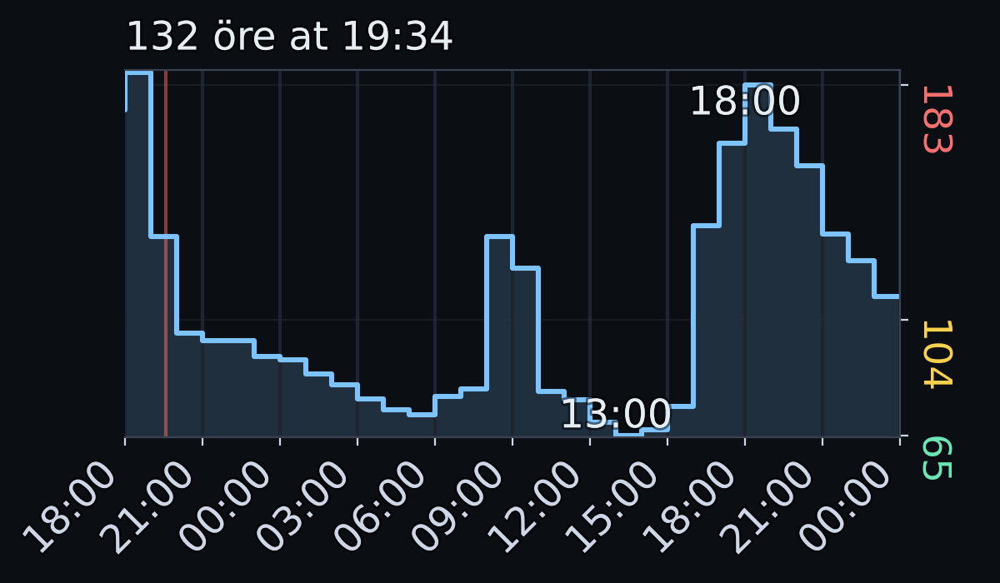

#  Tibber Graph

Display Tibber prices as a graph in Home Assistant, exposed as a camera entity.

## Installation

1. Copy `tibber_graph` folder into `config/custom_components`
2. Configure _Tibber Graph_ (see below)
3. Restart Home Assistant

You will now have a `camera.tibber_graph_[your_address]` entity that displays the Tibber prices as a graph (and an image available at `http://homeassistant.local:8123/local/tibber_graph_[your_address].png`).

## Configuration

> [!IMPORTANT]
> The [official Tibber integration](https://www.home-assistant.io/integrations/tibber/) needs to be configurated for this custom component to work (you can [sign up for Tibber](https://tibber.com/se/invite/gqpkcwrn) using the invitation code `gqpkcwrn` to get a **€50/500 kr bonus** for use in the [Tibber Store](https://tibber.com/se/store)).

### `configuration.yaml`

Simply add the following line:

```yaml
tibber_graph:
```

### `config.py`

In `custom_components/tibber_graph/config.py` you can adjust the graph appearance by changing the parameters controlling how the graph is rendered. For example, you can modify colors, dimensions, and other visual aspects of the graph to your liking.

**Optional colored labels:** Enable colored min/max price markers and Y-axis ticks with:

```python
LABEL_USE_COLORS = True      # Color min/max labels (green/red)
Y_TICK_USE_COLORS = True     # Color Y-axis ticks (green/amber/red)
```

> [!TIP]
> After changing any of the parameters, make sure to restart Home Assistant to apply the changes.

#### Examples

Graph rendered with only defaults (only values from [`defaults.py`](custom_components/tibber_graph/defaults.py)):


Graph rendered with the default component configuration (including values from [`config.py`](custom_components/tibber_graph/config.py)):



Graph rendered with random price data and light mode (including values from [`config.py`](tests/local_render/config.py)):


## Credits

- [Daniel Hjelseth Høyer](https://github.com/Danielhiversen) for the original [Tibber Custom](https://github.com/Danielhiversen/home_assistant_tibber_custom) integration
- [Jvgvisser](https://github.com/Jvgvisser) for [inspiration](https://github.com/Danielhiversen/home_assistant_tibber_custom/issues/65#issuecomment-3371070128)
