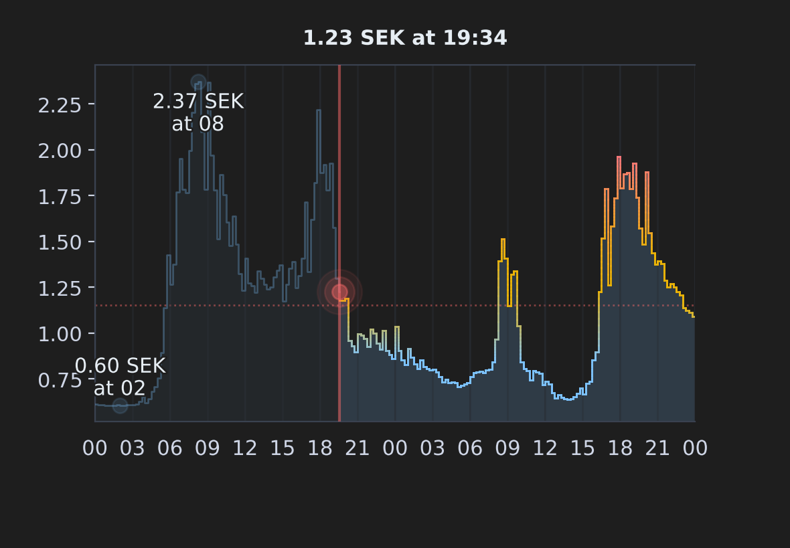
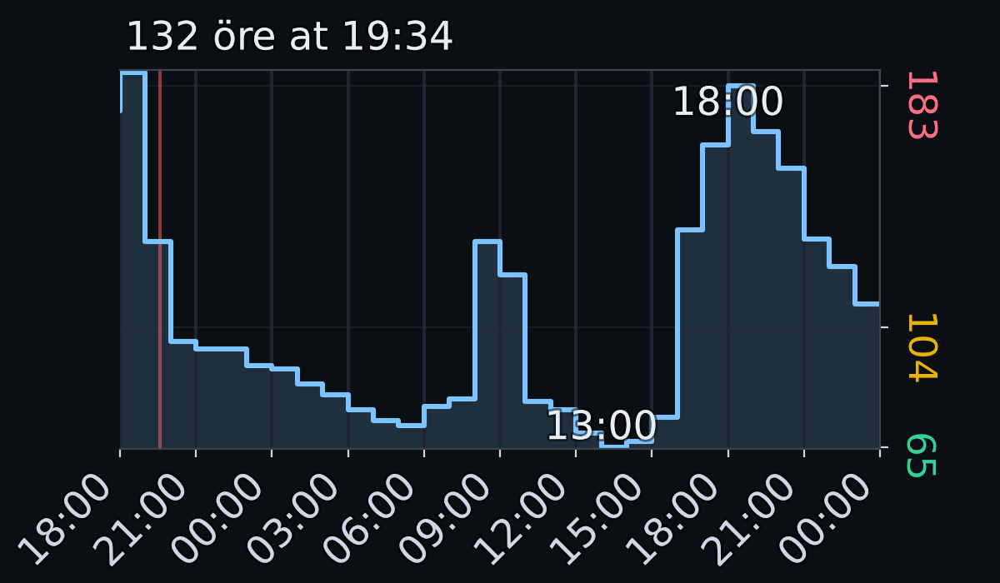
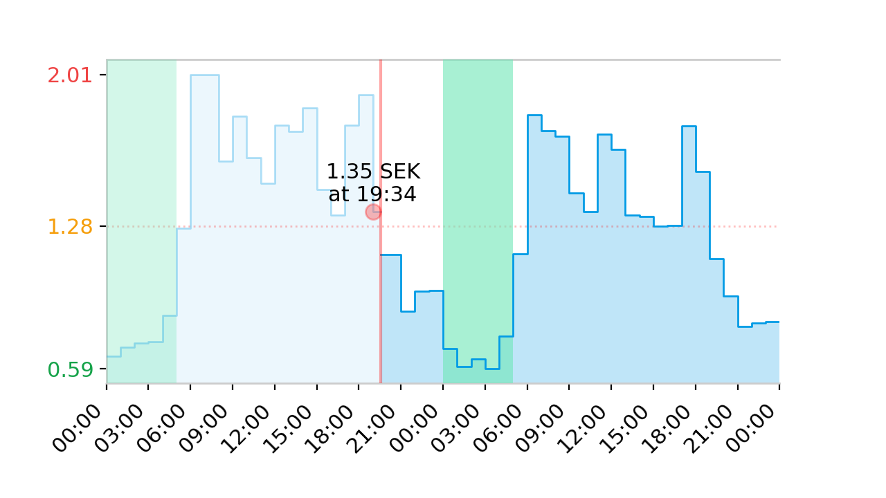

#  Tibber Graph

Display future (and past) Tibber prices as a graph in Home Assistant, exposed as a camera entity.

## Installation

### HACS (Recommended)

1. Ensure that [HACS](https://hacs.xyz) is installed
2. Open repository and click **Download** to install
3. Restart Home Assistant

### Manual Installation

1. Copy the `custom_components/tibber_graph` folder into `config/custom_components`
2. Restart Home Assistant

## Configuration

> [!IMPORTANT]
> The [official Tibber integration](https://www.home-assistant.io/integrations/tibber/) needs to be configurated for this custom component to work (you can [sign up for Tibber](https://tibber.com/se/invite/gqpkcwrn) using the invitation code `gqpkcwrn` to get a **€50/500 kr bonus** for use in the [Tibber Store](https://tibber.com/se/store)).

Configure the **Tibber Graph** integration:

Or:

1. Go to **Settings** → **Integrations**
2. Click **Add Integration**
3. Search for "**Tibber Graph**"

You will now have a `camera.tibber_graph_[your_address]` entity that displays the Tibber prices as a graph (and an image available at `http://homeassistant.local:8123/local/tibber_graph_[your_address].png`).

### Advanced Customization

All configurable options are available through the Home Assistant UI (**Settings → Devices & Services → Tibber Graph → Configure**).

For a complete list of available options, their descriptions, and default values, see **[OPTIONS.md](OPTIONS.md)**.

## Examples

Graph rendered with only defaults (pure [`defaults.py`](custom_components/tibber_graph/defaults.py)):

Graph rendered with my configuration (dark theme, hourly prices, colored Y-ticks):

Graph rendered with test configuration (light theme, colored labels and Y-ticks):

## Credits

- [Daniel Hjelseth Høyer](https://github.com/Danielhiversen) for the original [Tibber Custom](https://github.com/Danielhiversen/home_assistant_tibber_custom) integration
- [Jvgvisser](https://github.com/Jvgvisser) for [inspiration](https://github.com/Danielhiversen/home_assistant_tibber_custom/issues/65#issuecomment-3371070128)
