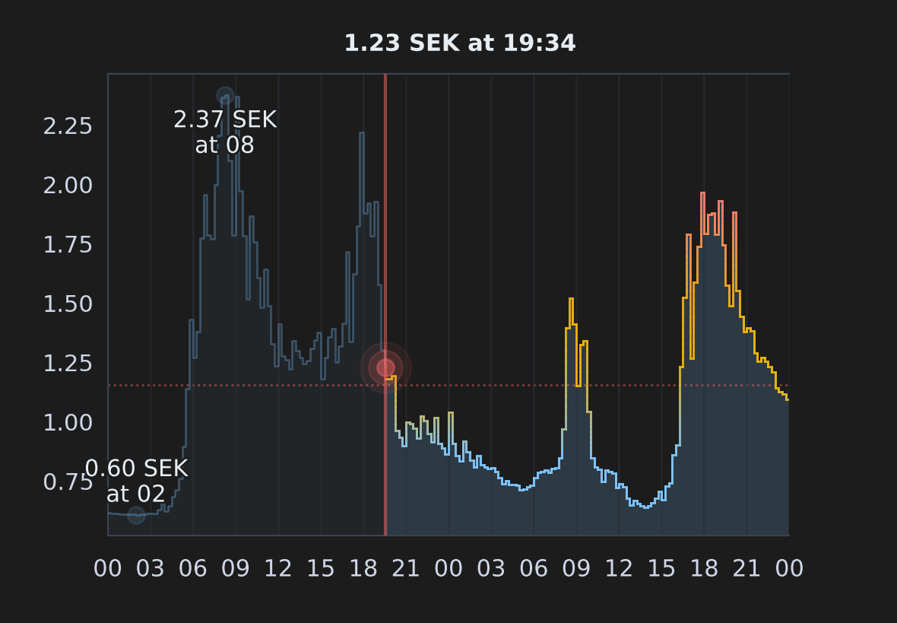

<!-- markdownlint-disable MD033 -->
<!-- markdownlint-disable MD051 -->

#  Tibber Graph

[](https://github.com/custom-components/hacs)

[](https://tooomm.github.io/github-release-stats/?username=stefanes&repository=tibber-graph)
[](https://github.com/stefanes/tibber-graph/issues)

Display future (and past) electricity prices as a graph in Home Assistant. **Tibber Graph** was built for the official [Tibber integration](https://www.home-assistant.io/integrations/tibber/), but supports any compatible price sensor as a data source such as [Nord Pool](https://www.home-assistant.io/integrations/nordpool) (see example [below](#nord-pool-official-integration)) or [EPEX Spot](https://github.com/mampfes/ha_epex_spot).



## Installation

### HACS (Recommended)

1. Ensure that [HACS](https://hacs.xyz) is installed
2. Open repository and click **Download** to install
3. Restart Home Assistant

[](https://my.home-assistant.io/redirect/hacs_repository/?owner=stefanes&repository=tibber-graph)

### Manual Installation

1. Copy the `custom_components/tibber_graph` folder into `config/custom_components`
2. Restart Home Assistant

## Configuration

### Setup

Configure the **Tibber Graph** integration:

[](https://my.home-assistant.io/redirect/integration/?domain=tibber_graph)

Or:

1. Go to **Settings** → **Integrations**
2. Click **Add Integration**
3. Search for "**Tibber Graph**"

You will now have a `camera.tibber_graph_{entity_name}` entity that displays the electricity prices as a graph, see [Provided entities](#provided-entities) below for details.

The integration will appear in **Settings → Devices & services → Tibber Graph** with the entity name you provided during setup (or your Tibber home name if no entity name was specified).


### Data Source

You can configure Tibber Graph to get price data from either:

1. **Tibber Integration** (default): Uses the official [Tibber integration](https://www.home-assistant.io/integrations/tibber/) to fetch prices directly. You can [sign up for Tibber](https://tibber.com/se/invite/gqpkcwrn) using the invitation code `gqpkcwrn` to get a **€50/500 kr bonus** for use in the [Tibber Store](https://tibber.com/se/store).

2. **Custom Entity**: Provide any Home Assistant sensor entity that contains price data in its attributes. The entity must have either a `prices` or `data` attribute containing a list of prices with `start_time`|`start`|`startsAt` and `price`|`price_per_kwh`|`total` fields (see [examples](#custom-data-source) and [schema](#schema) below).

The price data source can be changed at any time using the `tibber_graph.set_data_source` action (see [Actions](#actions) section below).

### Advanced Customization

All configurable options are available through the Home Assistant UI (**Settings → Devices & services → Tibber Graph → [Entity Name] ⚙**).

Key features include:

- **Multiple graph views**: Create separate entities with different configurations
- **Flexible time ranges**: Show all available data or specify a custom hour range
- **Theme customization**: Light and dark themes with optional transparent background
- **Price highlighting**: Highlight the cheapest price periods with colored backgrounds
- **Grid and axis control**: Customize gridlines, axis position, and tick formatting
- **Label options**: Configure min/max/current price labels with colors and positioning

For a complete list of available options, their descriptions, and default values, see **[OPTIONS.md](docs/OPTIONS.md)**.


#### Reconfiguration

You can reconfigure an existing Tibber Graph integration instance to reset specific settings back to their defaults by navigating to **Settings → Devices & services → Tibber Graph → [Entity Name] ⋮ → Reconfigure**

The reconfigure dialog allows you to:

- **Reset nullable fields**: Reset specific nullable configuration values (hours to show, Y-axis tick count, price decimals, currency override) back to their defaults
- **Reset all settings**: Clear all custom configuration and return to default settings

### Provided Entities

Tibber Graph provides the following entities:

#### `camera.tibber_graph_{entity_name}`

This entity displays the electricity prices as a graph. It also generates an image available here:

- <http://homeassistant.local:8123/local/tibber_graph_{entity_name}.png>
- `/config/www/tibber_graph_{entity_name}.png`

#### `sensor.tibber_graph_{entity_name}_last_update`

This sensor provides the timestamp of the last successful image render for the corresponding camera entity. The sensor has a device class of `timestamp` and can be used in automations or to monitor when the graph was last updated.

**Attributes:**

- `data_source_entity_id`: The entity ID used as the price data source (empty string if using Tibber integration)
- `data_source_friendly_name`: The friendly name of the data source entity (or "Tibber Integration" if using Tibber integration)
- `triggered_by`: The source that triggered the rendering. Possible values:
  - `camera_access`: Graph was rendered when the camera entity was accessed
  - `action`: Graph was rendered via the `tibber_graph.render` action
  - `auto_refresh`: Graph was rendered by the automatic refresh mechanism

### Actions

Tibber Graph provides actions for managing the graph configuration and rendering. These actions can be used in Home Assistant automations or scripts to dynamically update the graph appearance:

#### `tibber_graph.set_option`

Update one or more configuration options for an entity. The entity will be reloaded automatically after the options are updated.

| Data attribute | Required | Description                                                                                                                                                                                            |
| -------------- | -------- | ------------------------------------------------------------------------------------------------------------------------------------------------------------------------------------------------------ |
| `entity_id`    | Yes      | The entity ID of the camera to update                                                                                                                                                                  |
| `options`      | Yes      | Dictionary of options to update, where keys are option names (as defined in [OPTIONS.md](docs/OPTIONS.md)) and values are the new values                                                                    |
| `overwrite`    | No       | When `true`, all options **not** provided in the `options` dictionary will be reset to their default values. When `false` (default), only provided options are updated, existing options are preserved |

**Examples:**

```yaml
# Change theme to light mode
action: tibber_graph.set_option
data:
  entity_id: camera.tibber_graph_nord_pool_price
  options:
    theme: light
```

```yaml
# Update multiple options at once
action: tibber_graph.set_option
data:
  entity_id: camera.tibber_graph_nord_pool_price
  options:
    theme: dark
    transparent_background: true
    canvas_width: 1920
    canvas_height: 1080
    show_average_price_line: true
    currency_override: null # reset nullable option to default
```

```yaml
# Update specific options and reset all others to defaults (overwrite mode)
action: tibber_graph.set_option
data:
  entity_id: camera.tibber_graph_nord_pool_price
  options:
    theme: light
    canvas_width: 1920
  overwrite: true
# All options not listed (canvas_height, show_average_price_line, etc.)
# will be reset to their default values
```

#### `tibber_graph.reset_option`

Reset one or more configuration options to their default values for an entity. The entity will be reloaded automatically after the options are reset.

| Data attribute | Required | Description                                                                                                                              |
| -------------- | -------- | ---------------------------------------------------------------------------------------------------------------------------------------- |
| `entity_id`    | Yes      | The entity ID of the camera to reset options for                                                                                         |
| `options`      | No       | List of option names to reset (as defined in [OPTIONS.md](docs/OPTIONS.md)). Leave empty or omit to reset all options to their default values |

**Examples:**

```yaml
# Reset specific options to defaults
action: tibber_graph.reset_option
data:
  entity_id: camera.tibber_graph_nord_pool_price
  options:
    - theme
    - canvas_width
    - show_average_price_line
```

```yaml
# Reset all options to defaults
action: tibber_graph.reset_option
data:
  entity_id: camera.tibber_graph_nord_pool_price
```

#### `tibber_graph.set_data_source`

Change the price data source for an entity. This allows you to switch between the Tibber integration and/or custom price entities.

| Data attribute    | Required | Description                                                                                                |
| ----------------- | -------- | ---------------------------------------------------------------------------------------------------------- |
| `entity_id`       | Yes      | The entity ID of the camera to update the data source for                                                  |
| `price_entity_id` | No       | The entity ID of a sensor containing price data. Leave empty or omit to use the Tibber integration instead |

**Examples:**

```yaml
# Switch to a custom price entity
action: tibber_graph.set_data_source
data:
  entity_id: camera.tibber_graph_nord_pool_price
  price_entity_id: sensor.nord_pool_price
```

```yaml
# Switch back to Tibber integration
action: tibber_graph.set_data_source
data:
  entity_id: camera.tibber_graph_tibber_price
```

#### `tibber_graph.render`

Render the graph for an entity. If `entity_id` is not provided, renders all Tibber Graph entities.

| Data attribute | Required | Description                                                                                                   |
| -------------- | -------- | ------------------------------------------------------------------------------------------------------------- |
| `entity_id`    | No       | The entity ID (or list of entity IDs) of the camera to render for. If not provided, all entities are rendered |

**Examples:**

```yaml
# Force render a specific entity
action: tibber_graph.render
data:
  entity_id: camera.tibber_graph_nord_pool_price
```

```yaml
# Force render multiple entities
action: tibber_graph.render
data:
  entity_id:
    - camera.tibber_graph_tibber_price
    - camera.tibber_graph_nord_pool_price
```

```yaml
# Force render all Tibber Graph entities
action: tibber_graph.render
```

#### `tibber_graph.set_custom_theme`

Set a custom theme for an entity, allowing you to dynamically change the graph's color scheme. All theme properties must be provided when setting a custom theme. Call without `theme_config` to clear the custom theme and revert to the configured theme.

| Data attribute | Required | Description                                                                                 |
| -------------- | -------- | ------------------------------------------------------------------------------------------- |
| `entity_id`    | Yes      | The entity ID of the camera to set the custom theme for                                     |
| `theme_config` | No       | Dictionary containing all 23 theme properties. If omitted or empty, clears the custom theme |

For detailed information about theme properties, complete examples, and automation ideas, see **[CUSTOM_THEME.md](docs/CUSTOM_THEME.md)**.

**Examples:**

```yaml
# Set a custom purple theme
action: tibber_graph.set_custom_theme
data:
  entity_id: camera.tibber_graph_nord_pool_price
  theme_config:
    axis_label_color: "#d8b9ff"
    background_color: "#1a0f2e"
    cheap_price_color: "#2d3d5a"
    fill_alpha: 0.2
    fill_color: "#9d7cff"
    grid_alpha: 0.4
    grid_color: "#3d2f50"
    label_color: "#f0e6ff"
    label_color_avg: "#ffb347"
    label_color_max: "#ff6b9d"
    label_color_min: "#7cffb3"
    label_stroke: true
    nowline_alpha: 0.6
    nowline_color: "#ff6b9d"
    plot_linewidth: 1.2
    price_line_color: "#9d7cff"
    price_line_color_above_avg: "#ff6b9d"
    price_line_color_below_avg: "#9d7cff"
    price_line_color_near_avg: "#ffb347"
    spine_color: "#503d70"
    tick_color: "#d8b9ff"
    tickline_color: "#2e1f45"
```

```yaml
# Clear custom theme and revert to configured theme
action: tibber_graph.set_custom_theme
data:
  entity_id: camera.tibber_graph_nord_pool_price
```

## Custom Data Source

Examples of custom data sources that can be used with Tibber Graph (see [schema](#schema) below).

> [!TIP]
> See the [`home-assistant-config`](https://github.com/stefanes/home-assistant-config) repo for more complete examples.

### Tibber

Install and configure the official [Tibber integration](https://www.home-assistant.io/integrations/tibber/) and create a template sensor:

```yaml
template:
  - trigger:
      - trigger: time
        at: "14:00:00"
      - trigger: homeassistant
        event: start
    action:
      - action: tibber.get_prices
        data:
          start: "{{ (today_at()).strftime('%Y-%m-%d %H:%M:%S') }}"
          end: "{{ (today_at() + timedelta(days=1)).strftime('%Y-%m-%d %H:%M:%S') }}"
        response_variable: today_prices
      - action: tibber.get_prices
        data:
          start: "{{ (today_at() + timedelta(days=1)).strftime('%Y-%m-%d %H:%M:%S') }}"
          end: "{{ (today_at() + timedelta(days=2)).strftime('%Y-%m-%d %H:%M:%S') }}"
        response_variable: tomorrow_prices
    sensor:
      - name: Tibber price
        state: >
          
          {{ (prices | map(attribute='price') | sum / prices | count)  | round(3, default=0) }}
        unit_of_measurement: SEK/kWh
        state_class: total
        device_class: monetary
        unique_id: tibber_price
        icon: mdi:cash-multiple
        availability: >
          {{ today_prices is mapping and today_prices.prices.values() | first | length > 0 }}
        attributes:
          prices: >
            {{ today_prices.prices.values() | first + tomorrow_prices.prices.values() | first }}
```

### Nord Pool

Install and configure the official [Nord Pool integration](https://www.home-assistant.io/integrations/nordpool) and create a template sensor:

> [!IMPORTANT]
> Replace `{nord_pool_config_entry_id}` and `{nord_pool_area}` area below with your Nord Pool config entry ID and area. You can get the `config_entry_id` by navigating to **Settings → Devices & services → Entities**, selecting one of the entities belonging to the integration, selecting **⋮ → Related → Integration** and copying the last part of the URL (`.../config/integrations/integration/nordpool#config_entry={nord_pool_config_entry_id}`).

```yaml
template:
  - trigger:
      - trigger: time
        at: "14:00:00"
      - trigger: homeassistant
        event: start
    action:
      - variables:
          config_entry: "{nord_pool_config_entry_id}"
          area: "{nord_pool_area}"
      - action: nordpool.get_prices_for_date
        data:
          config_entry: "{{ config_entry }}"
          date: "{{ now().date() }}"
        response_variable: today_prices
      - action: nordpool.get_prices_for_date
        data:
          config_entry: "{{ config_entry }}"
          date: "{{ now().date() + timedelta(days=1) }}"
        response_variable: tomorrow_prices
    sensor:
      - name: Nord Pool price
        state: >
          
          {{ (prices | map(attribute='price') | sum / prices | count / 1000 * 1.25 + 0.086) | round(3, default=0) }}
        #                                                              ^      ^      ^
        #                                                              |      |      |
        #                                     convert to SEK per kWh --┘      |      |
        #                                     add 25% VAT --------------------┘      |
        #                                     add 0.086 SEK/kWh markup --------------┘
        unit_of_measurement: SEK/kWh
        state_class: total
        device_class: monetary
        unique_id: nord_pool_price
        icon: mdi:cash-multiple
        availability: >
          {{ today_prices is mapping and today_prices[area] | length > 0 }}
        attributes:
          data: >
            
            
            
                
                
                
            
            {{ ns.prices }}
```

### EPEX Spot

Install and configure the [EPEX Spot integration](https://github.com/mampfes/ha_epex_spot). The price sensors provided by this integration can be used directly as the data source for Tibber Graph, as they already expose the [required `data` attribute](https://github.com/mampfes/ha_epex_spot?tab=readme-ov-file#2-market-price-sensor).

### Schema

```yaml
attributes:
  {prices|data}:
    - {"start_time"|"start"|"startsAt"}: datetime # datetime string in ISO 8601 format
      {"price"|"price_per_kwh"|"total"}: float    # price per kWh
    - ...
```

## Example Graphs

> [!TIP]
> Use the configuration snippets below together with the `tibber_graph.set_option` action to reproduce the example graphs.

<details>
<summary>Graph rendered with old (v0.2.1) defaults:</summary>

```yaml
canvas_width: 1200
canvas_height: 700
show_y_axis_ticks: true
label_current_in_header: false
color_price_line_by_average: false
```

</details>


<details>
<summary>Graph rendered with Wear OS configuration:</summary>

```yaml
theme: dark
transparent_background: true
canvas_width: 1280
canvas_height: 720
show_x_ticks: true
cheap_price_on_x_axis: true
start_graph_at: current_hour
show_y_axis_ticks: true
y_axis_label_rotation_deg: 270
y_axis_side: right
y_tick_count: 2
y_tick_use_colors: true
cheap_price_points: 5
use_hourly_prices: true
use_cents: true
currency_override: öre
label_current_in_header_more: false
label_font_size: 17
label_minmax_show_price: false
```

</details>


<details>
<summary>Graph rendered with random price data and light mode:</summary>

```yaml
theme: light
show_x_ticks: true
show_vertical_grid: false
y_tick_count: 3
y_tick_use_colors: true
cheap_price_points: 5
cheap_price_threshold: 1.0
use_hourly_prices: true
label_min: false
label_max: false
label_current_in_header: false
color_price_line_by_average: false
```

</details>


## Credits

- [Daniel Hjelseth Høyer](https://github.com/Danielhiversen) for the original [Tibber Custom](https://github.com/Danielhiversen/home_assistant_tibber_custom) integration
- [Jvgvisser](https://github.com/Jvgvisser) for [inspiration](https://github.com/Danielhiversen/home_assistant_tibber_custom/issues/65#issuecomment-3371070128)
