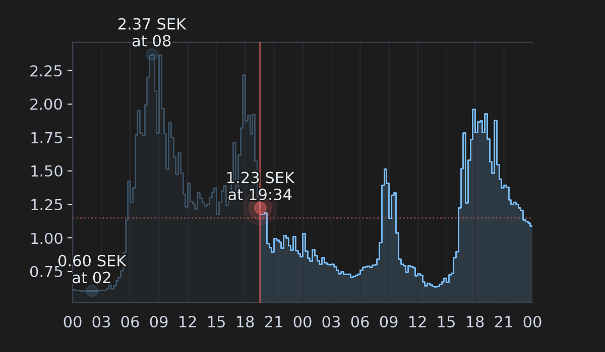

<!-- markdownlint-disable MD033 -->
<!-- markdownlint-disable MD051 -->

#  Tibber Graph

[](https://github.com/hacs/default)
[](https://github.com/stefanes/tibber-graph/releases)
[](https://tooomm.github.io/github-release-stats/?username=stefanes&repository=tibber-graph)
[](https://github.com/stefanes/tibber-graph/issues)

Display past and future electricity prices as a graph in Home Assistant - an out-of-the-box alternative to e.g. [Apex Charts](https://github.com/RomRider/apexcharts-card). **Tibber Graph** was originally built for the official [Tibber integration](https://www.home-assistant.io/integrations/tibber/) but supports [any price sensor](#price-sensors-as-data-source) as a data source, such as [Nord Pool](https://www.home-assistant.io/integrations/nordpool) or [EPEX Spot](https://github.com/mampfes/ha_epex_spot).


## Installation

### HACS (Recommended)

1. Ensure that [HACS](https://hacs.xyz) is installed
2. Open repository and click **Download** to install
3. Restart Home Assistant

[](https://my.home-assistant.io/redirect/hacs_repository/?owner=stefanes&repository=tibber-graph)

### Manual Installation

1. Copy the contents of the [`custom_components/tibber_graph` folder](custom_components/tibber_graph/) into `config/custom_components/tibber_graph`
2. Restart Home Assistant

## Configuration

### Setup

Configure the **Tibber Graph** integration:

[](https://my.home-assistant.io/redirect/integration/?domain=tibber_graph)

Or:

1. Go to **[Settings → Devices & services](https://my.home-assistant.io/redirect/integrations/)**
2. Click **Add integration**
3. Search for "**Tibber Graph**"

You will now have camera and image entities that displays the electricity prices as a graph, see [Provided entities](#provided-entities) below for details.

The integration will appear in **[Settings → Devices & services → Tibber Graph](https://my.home-assistant.io/redirect/integration/?domain=tibber_graph)** with the entity name you provided during setup (or your Tibber home name if no entity name was specified).


### Data Source

You can configure Tibber Graph to get price data from either:

1. **Tibber Integration** (default): Uses the official [Tibber integration](https://www.home-assistant.io/integrations/tibber/) to fetch prices directly. You can [sign up for Tibber](https://tibber.com/se/invite/gqpkcwrn) using the invitation code `gqpkcwrn` to get a **€50/500 kr bonus** for use in the [Tibber Store](https://tibber.com/se/store).

2. **Price Sensor**: Provide any Home Assistant price sensor that contains price data in its attributes. See [Price Sensors as Data Source](#price-sensors-as-data-source) below for details.

> [!TIP]
> The data source can be changed at any time using the [`tibber_graph.create_graph`](#tibber_graphcreate_graph) or [`tibber_graph.set_data_source`](#tibber_graphset_data_source) actions.

### Advanced Customization

All configurable options are available through the Home Assistant UI (**[Settings → Devices & services → Tibber Graph](https://my.home-assistant.io/redirect/integration/?domain=tibber_graph) → [Entity Name] ⚙**).

Key features include:

- **Multiple graph views**: Create separate entities with different configurations
- **Flexible time ranges**: Show all available data or specify a custom hour range
- **Theme customization**: Light and dark themes with optional transparent background
- **Price highlighting**: Highlight the cheapest price periods with colored backgrounds
- **Grid and axis control**: Customize gridlines, axis position, and tick formatting
- **Label options**: Configure min/max/current price labels with colors and positioning

For a complete list of available options, their descriptions, and default values, see **[OPTIONS.md](docs/OPTIONS.md)**.


#### Reconfiguration

You can reconfigure an existing Tibber Graph integration instance to reset specific settings back to their defaults by navigating to **[Settings → Devices & services → Tibber Graph](https://my.home-assistant.io/redirect/integration/?domain=tibber_graph) → [Entity Name] ⋮ → Reconfigure**

The reconfigure dialog allows you to:

- **Reset nullable fields**: Reset specific nullable configuration values (hours to show, Y-axis tick count, price decimals, currency override) back to their defaults
- **Reset all settings**: Clear all custom configuration and return to default settings


### Provided Entities

Tibber Graph provides the following entities:

#### `camera.tibber_graph_{entity_name}`

This entity displays the electricity prices as a [camera image](https://www.home-assistant.io/integrations/camera/). It also generates a `.png` image available here:

- <http://homeassistant.local:8123/local/tibber_graph_{entity_name}.png>
- `/config/www/tibber_graph_{entity_name}.png`

#### `image.tibber_graph_{entity_name}`

This entity exposes the generated graph as an [image](https://www.home-assistant.io/integrations/image/).

> [!NOTE]
> For the graph to update you will need to either access the camera entity, enable [refresh on interval](docs/OPTIONS.md#refresh-mode), or call the [`tibber_graph.render` action](#tibber_graphrender).

#### `sensor.tibber_graph_{entity_name}_last_update`

This sensor provides the timestamp of the last successful image render for the corresponding camera entity. The sensor has a device class of `timestamp` and can be used in automations or to monitor when the graph was last updated.

**Attributes:**

- `data_source_entity_id`: The entity ID of the [price sensor used as a data source](#price-sensors-as-data-source) (empty string if using Tibber integration)
- `data_source_friendly_name`: The friendly name of the price sensor (or "Tibber Integration" if using Tibber integration)
- `triggered_by`: The source that triggered the rendering. Possible values:
  - `camera_access`: Graph was rendered when the camera entity was accessed
  - `action`: Graph was rendered via the [`tibber_graph.render` action](#tibber_graphrender)
  - `interval_refresh`: Graph was rendered by the interval refresh mechanism

### Actions

Tibber Graph provides actions for managing the graph configuration and rendering. These actions can be used in Home Assistant automations or scripts to dynamically update the graph appearance:

#### `tibber_graph.set_option`

Update one or more configuration options for an entity. The entity will be reloaded automatically after the options are updated.

| Data attribute | Required | Description                                                                                                                                                                                             |
| -------------- | -------- | ------------------------------------------------------------------------------------------------------------------------------------------------------------------------------------------------------- |
| `entity_id`    | Yes      | The entity ID of the camera to update.                                                                                                                                                                  |
| `options`      | Yes      | Dictionary of options to update, where keys are option names (as defined in [OPTIONS.md](docs/OPTIONS.md)) and values are the new values.                                                               |
| `overwrite`    | No       | When `true`, all options **not** provided in the `options` dictionary will be reset to their default values. When `false` (default), only provided options are updated, existing options are preserved. |

**Examples:**

```yaml
# Change theme to light mode
action: tibber_graph.set_option
data:
  entity_id: camera.tibber_graph_nord_pool_price
  options:
    theme: "light"
```

```yaml
# Update multiple options at once
action: tibber_graph.set_option
data:
  entity_id: camera.tibber_graph_nord_pool_price
  options:
    theme: "dark"
    transparent_background: true
    canvas_width: 1920
    canvas_height: 1080
    show_average_price_line: true
    currency_override: null # reset nullable option to default
```

```yaml
# Update specific options and reset all others to defaults (overwrite mode)
action: tibber_graph.set_option
data:
  entity_id: camera.tibber_graph_nord_pool_price
  options:
    theme: "light"
    canvas_width: 1920
  overwrite: true
# All options not listed (canvas_height, show_average_price_line, etc.)
# will be reset to their default values
```

#### `tibber_graph.reset_option`

Reset one or more configuration options to their default values for an entity. The entity will be reloaded automatically after the options are reset.

| Data attribute | Required | Description                                                                                                                                    |
| -------------- | -------- | ---------------------------------------------------------------------------------------------------------------------------------------------- |
| `entity_id`    | Yes      | The entity ID of the camera to reset options for.                                                                                              |
| `options`      | No       | List of option names to reset (as defined in [OPTIONS.md](docs/OPTIONS.md)). Leave empty or omit to reset all options to their default values. |

**Examples:**

```yaml
# Reset specific options to defaults
action: tibber_graph.reset_option
data:
  entity_id: camera.tibber_graph_nord_pool_price
  options:
    - theme
    - canvas_width
    - show_average_price_line
```

```yaml
# Reset all options to defaults
action: tibber_graph.reset_option
data:
  entity_id: camera.tibber_graph_nord_pool_price
```

#### `tibber_graph.set_data_source`

Change the data source for an entity. This allows you to switch between the Tibber integration and/or price sensors as a data source.

| Data attribute    | Required | Description                                                                                                 |
| ----------------- | -------- | ----------------------------------------------------------------------------------------------------------- |
| `entity_id`       | Yes      | The entity ID of the camera to update the data source for.                                                  |
| `price_entity_id` | No       | The entity ID of a sensor containing price data. Leave empty or omit to use the Tibber integration instead. |

See also [Custom attributes & fields](#custom-attributes--fields) below for how to specify custom attributes and fields.

**Examples:**

```yaml
# Switch to a price sensor as data source
action: tibber_graph.set_data_source
data:
  entity_id: camera.tibber_graph_nord_pool_price
  price_entity_id: sensor.nord_pool_price
```

```yaml
# Switch back to Tibber integration
action: tibber_graph.set_data_source
data:
  entity_id: camera.tibber_graph_tibber_price
```

#### `tibber_graph.render`

Render the graph for an entity. If `entity_id` is not provided, renders all Tibber Graph entities.

| Data attribute | Required | Description                                                                                                |
| -------------- | -------- | ---------------------------------------------------------------------------------------------------------- |
| `entity_id`    | No       | The entity ID (or list of entity IDs) of the camera to render. If not provided, all entities are rendered. |

**Examples:**

```yaml
# Force render entities
action: tibber_graph.render
data:
  entity_id:
    - camera.tibber_graph_tibber_price
    - camera.tibber_graph_nord_pool_price
```

```yaml
# Force render all Tibber Graph entities
action: tibber_graph.render
```

#### `tibber_graph.set_custom_theme`

Set a custom theme for an entity, allowing you to dynamically change the graph's color scheme. All theme properties must be provided when setting a custom theme. Call without `theme_config` to clear the custom theme and revert to the configured theme.

| Data attribute | Required | Description                                                                                  |
| -------------- | -------- | -------------------------------------------------------------------------------------------- |
| `entity_id`    | Yes      | The entity ID of the camera to set the custom theme for.                                     |
| `theme_config` | No       | Dictionary containing all 23 theme properties. If omitted or empty, clears the custom theme. |

For detailed information about theme properties, complete examples, and automation ideas, see **[CUSTOM_THEME.md](docs/CUSTOM_THEME.md)**.

**Examples:**

```yaml
# Set a custom purple theme
action: tibber_graph.set_custom_theme
data:
  entity_id: camera.tibber_graph_nord_pool_price
  theme_config:
    axis_label_color: "#d8b9ff"
    background_color: "#1a0f2e"
    cheap_price_color: "#2d3d5a"
    fill_alpha: 0.2
    fill_color: "#9d7cff"
    grid_alpha: 0.4
    grid_color: "#3d2f50"
    label_color: "#f0e6ff"
    label_color_avg: "#ffb347"
    label_color_max: "#ff6b9d"
    label_color_min: "#7cffb3"
    label_stroke: true
    nowline_alpha: 0.6
    nowline_color: "#ff6b9d"
    plot_linewidth: 1.2
    price_line_color: "#9d7cff"
    price_line_color_above_avg: "#ff6b9d"
    price_line_color_below_avg: "#9d7cff"
    price_line_color_near_avg: "#ffb347"
    spine_color: "#503d70"
    tick_color: "#d8b9ff"
    tickline_color: "#2e1f45"
```

```yaml
# Clear custom theme and revert to configured theme
action: tibber_graph.set_custom_theme
data:
  entity_id: camera.tibber_graph_nord_pool_price
```

> [!TIP]
> Please do not hesitate to share your [custom themes](docs/CUSTOM_THEME.md) with the community by opening a pull request to get it added to the list of [built-in themes](custom_components/tibber_graph/themes.json).

#### `tibber_graph.create_graph`

Create a new Tibber Graph camera entity programmatically. This action allows you to create entities without using the UI, making it easy to set up multiple graphs with similar configurations. The action returns the entity ID of the created camera entity.

| Data attribute    | Required | Description                                                                                                                                                                                           |
| ----------------- | -------- | ----------------------------------------------------------------------------------------------------------------------------------------------------------------------------------------------------- |
| `entity_name`     | No       | The name of the new entity. Must be unique. If not provided, auto-generated from the price entity friendly name or Tibber home name. Will be prefixed with "Tibber Graph" for the camera entity name. |
| `price_entity_id` | No       | The entity ID of a sensor containing price data. If not provided, the Tibber integration will be used.                                                                                                |
| `options`         | No       | Dictionary of options to set for the new entity. Keys should be option names (as defined in [OPTIONS.md](docs/OPTIONS.md)).                                                                           |
| `custom_theme`    | No       | Dictionary defining a custom theme. Keys should be theme property names (as defined in [CUSTOM_THEME.md](docs/CUSTOM_THEME.md)).                                                                      |
| `recreate`        | No       | If `true`, recreate the entity if it already exists. If `false` (default), an error will be raised if an entity with the same name exists.                                                            |

See also [Custom attributes & fields](#custom-attributes--fields) below for how to specify custom attributes and fields.

**Examples:**

```yaml
# Create a basic entity using Tibber integration (auto-generated name)
action: tibber_graph.create_graph
```

```yaml
# Re-create an entity with a price sensor as data source and specific options
action: tibber_graph.create_graph
data:
  entity_name: "Living Room Display"
  price_entity_id: sensor.nord_pool_price
  options:
    theme: "light"
    canvas_width: 1920
    canvas_height: 1080
    transparent_background: true
    show_average_price_line: true
    cheap_price_points: 3
  recreate: true
```

```yaml
# Create an entity with custom theme
action: tibber_graph.create_graph
data:
  entity_name: "Purple Graph"
  price_entity_id: sensor.nord_pool_price
  custom_theme:
    axis_label_color: "#d8b9ff"
    background_color: "#1a0f2e"
    cheap_price_color: "#2d3d5a"
    fill_alpha: 0.2
    fill_color: "#9d7cff"
    grid_alpha: 0.4
    grid_color: "#3d2f50"
    label_color: "#f0e6ff"
    label_color_avg: "#ffb347"
    label_color_max: "#ff6b9d"
    label_color_min: "#7cffb3"
    label_stroke: true
    nowline_alpha: 0.6
    nowline_color: "#ff6b9d"
    plot_linewidth: 1.2
    price_line_color: "#9d7cff"
    price_line_color_above_avg: "#ff6b9d"
    price_line_color_below_avg: "#9d7cff"
    price_line_color_near_avg: "#ffb347"
    spine_color: "#503d70"
    tick_color: "#d8b9ff"
    tickline_color: "#2e1f45"
```

#### `tibber_graph.delete_graph`

Delete a Tibber Graph camera entity programmatically. This action removes the entity from Home Assistant.

| Data attribute | Required | Description                                         |
| -------------- | -------- | --------------------------------------------------- |
| `entity_id`    | Yes      | The entity ID of the Tibber Graph camera to delete. |

The action validates that the entity exists before deleting it and returns a confirmation message upon success.

**Examples:**

```yaml
# Delete a specific entity
action: tibber_graph.delete_graph
data:
  entity_id: camera.tibber_graph_nord_pool_price
```

## Price Sensors as Data Source

Any price sensor can be used as a data source as long as it exposes price data in its attributes in a compatible format. This allows you to use other electricity price providers or roll your own custom price sensor.

Sensors must either follow the data source format below (by transforming the data using a template sensors as with [Nord Pool](#nord-pool) or directly as with [EPEX Spot](#epex-spot)) or you can specify [custom attributes and fields](#custom-attributes--fields) when using the `tibber_graph.create_graph` or `tibber_graph.set_data_source` actions.

```yaml
# Data source format
attributes:
  {prices|data}:
    - {start_time|start|startsAt}: datetime # datetime string in ISO 8601 format
      {price|price_per_kwh|total}: float    # price per kWh
    - ...
  currency: string                          # (optional) currency string
```

> [!TIP]
> See the [`home-assistant-config` repo](https://github.com/stefanes/home-assistant-config) for more complete examples.

### Nord Pool

Install and configure the official [Nord Pool integration](https://www.home-assistant.io/integrations/nordpool) and create a template sensor:

> [!IMPORTANT]
> Replace `{nord_pool_config_entry_id}` and `{nord_pool_area}` area below with your Nord Pool config entry ID and area. You can get the `config_entry_id` by navigating to **[Settings → Devices & services → Entities](https://my.home-assistant.io/redirect/entities/)**, selecting one of the entities belonging to the integration, selecting **⋮ → Related → Integration** and copying the last part of the URL (`.../config/integrations/integration/nordpool#config_entry={nord_pool_config_entry_id}`).

```yaml
template:
  - trigger:
      - trigger: time
        at: "14:00:00"
      - trigger: homeassistant
        event: start
      - platform: event
        event_type: call_service
        event_data:
          domain: template
          service: reload
    action:
      - variables:
          config_entry: "{nord_pool_config_entry_id}"
          area: "{nord_pool_area}"
      - action: nordpool.get_prices_for_date
        data:
          config_entry: "{{ config_entry }}"
          date: "{{ now().date() }}"
        response_variable: today_prices
      - action: nordpool.get_prices_for_date
        data:
          config_entry: "{{ config_entry }}"
          date: "{{ now().date() + timedelta(days=1) }}"
        response_variable: tomorrow_prices
    sensor:
      - name: Nord Pool price (example)
        state: >
          
          {{ (prices | map(attribute='price') | sum / prices | count / 1000 * 1.25 + 0.086) | round(3, default=0) }}
        #                                                              ^      ^      ^
        #                                                              |      |      |
        #                                     convert to SEK per kWh --┘      |      |
        #                                     add 25% VAT --------------------┘      |
        #                                     add 0.086 SEK/kWh markup --------------┘
        unit_of_measurement: SEK/kWh
        state_class: total
        device_class: monetary
        unique_id: nord_pool_price_example
        icon: mdi:cash-multiple
        availability: >
          {{ today_prices is mapping and today_prices[area] | length > 0 }}
        attributes:
          data: >
            
            
            
                
                
                
            
            {{ ns.prices }}
          currency: "kr" # overrides currency from "unit_of_measurement"
```

### EPEX Spot

Install and configure the [EPEX Spot integration](https://github.com/mampfes/ha_epex_spot). The price sensors provided by this integration can be used directly as a data source as they expose a compatible [`data` attribute](https://github.com/mampfes/ha_epex_spot?tab=readme-ov-file#2-market-price-sensor).

### Custom attributes & fields

You can customize how price data is extracted and transformed using one or more of these parameters when calling the [`tibber_graph.create_graph`](#tibber_graphcreate_graph) or [`tibber_graph.set_data_source`](#tibber_graphset_data_source) actions:

| Parameter               | Type   | Description                                                                                                                                                                                       |
| ----------------------- | ------ | ------------------------------------------------------------------------------------------------------------------------------------------------------------------------------------------------- |
| `data_attr`             | String | Specify the attribute name containing the price data list.                                                                                                                                        |
| `data_attr_start_field` | String | Specify the field name for the start time in each price point.                                                                                                                                    |
| `data_attr_start_fmt`   | String | Specify the datetime format string for parsing timestamps (using Python's [format codes](https://docs.python.org/3/library/datetime.html#format-codes)). If not set, ISO 8601 format is expected. |
| `data_attr_price_field` | String | Specify the field name for the price value in each price point.                                                                                                                                   |
| `currency_attr`         | String | Specify the attribute name to read the currency symbol from.                                                                                                                                      |

> [!NOTE]
> If any of the above parameters are not provided, the default values will be used (see [Data source format](#price-sensors-as-data-source) above).

These parameters allow you to transform the price provided by the data source, in this order, before displaying them:

| Parameter                | Type   | Description                                                                                                                         |
| ------------------------ | ------ | ----------------------------------------------------------------------------------------------------------------------------------- |
| `data_attr_price_factor` | Number | Multiply each price by this factor. Useful for unit conversion (e.g., 0.001 for MWh to kWh) or adding VAT (e.g., 1.25 for 25% VAT). |
| `data_attr_price_add`    | Number | Add this value to each price. Useful for adding fixed costs like grid fees.                                                         |

#### Examples

Given a price sensor exposing data in the following format (prices in SEK/MWh without VAT or markup):

```yaml
sensor:
  - name: Nord Pool spot price
    ...
    unique_id: nord_pool_spot_price
    ...
    attributes:
      price_per_mwh:
        - from: 11/17/2025 00:00:00
          spot_price: 585.86
        - from: 11/17/2025 00:15:00
          spot_price: 578.4
          ...
      price_unit: kr
```

Create/update graph using the `tibber_graph.create_graph` and `tibber_graph.set_data_source` actions:

```yaml
# Create a graph with prices in SEK/kWh, including 25% VAT and a 0.086 SEK/kWh markup
action: tibber_graph.create_graph
data:
  price_entity_id: sensor.nord_pool_spot_price
  data_attr: "price_per_mwh"
  data_attr_start_field: "from"
  data_attr_start_fmt: "%m/%d/%Y %H:%M:%S"
  data_attr_price_field: "spot_price"
  data_attr_price_factor: 0.00125 # convert MWh to kWh and add 25% VAT
  data_attr_price_add: 0.086 # add 0.086 SEK/kWh markup
  currency_attr: "price_unit"
```

```yaml
# Revert back to spot price per MWh by omitting price transformation parameters
action: tibber_graph.set_data_source
data:
  entity_id: camera.tibber_graph_nord_pool_spot_price
  price_entity_id: sensor.nord_pool_spot_price
  data_attr: "price_per_mwh"
  data_attr_start_field: "from"
  data_attr_start_fmt: "%m/%d/%Y %H:%M:%S"
  data_attr_price_field: "spot_price"
  currency_attr: "price_unit"
```

## Example Graphs

> [!TIP]
> Use the configuration snippets below together with the [`tibber_graph.set_option` action](#tibber_graphset_option) to reproduce the example graphs.

<details>
<summary>Graph rendered with <a href="https://github.com/stefanes/tibber-graph/releases/tag/v0.2.1">version 0.2.1</a> defaults:</summary>

```yaml
# General settings
canvas_width: 1200
canvas_height: 700
color_price_line_by_average: false
# Price labels
label_current: "on_in_graph"
# Y-axis settings
show_y_axis: "on_with_tick_marks"
```

</details>



<details>
<summary>Graph rendered with my personal <a href="https://companion.home-assistant.io/docs/wear-os/#tiles">Wear OS camera tile</a> configuration:</summary>

```yaml
# General settings
theme: "dark"
transparent_background: true
canvas_width: 1280
canvas_height: 720
label_font_size: 17
start_graph_at: "current_hour"
cheap_price_points: 5
cheap_price_threshold: 0.5
# Price labels
use_hourly_prices: true
use_cents: true
currency_override: "öre"
label_current: "on_current_price_only"
label_min: "on_no_price"
label_max: "on_no_price"
# X-axis settings
show_x_axis: "on_with_tick_marks"
cheap_periods_on_x_axis: "on_comfy"
# Y-axis settings
show_y_axis: "on_with_tick_marks"
y_tick_count: 2
y_axis_label_rotation_deg: 270
y_axis_side: "right"
y_tick_use_colors: true
```

</details>


<details>
<summary>Graph rendered with light mode, cheap periods on X-axis, and colored Y-axis tick marks:</summary>

```yaml
# General settings
theme: "light"
cheap_price_points: 5
cheap_price_threshold: 1.0
color_price_line_by_average: false
# Price labels
use_hourly_prices: true
label_current: "on_in_graph"
label_min: "off"
label_max: "off"
# X-axis settings
show_x_axis: "on_with_tick_marks"
cheap_periods_on_x_axis: "on"
show_vertical_grid: false
# Y-axis settings
y_tick_count: 3
y_tick_use_colors: true
```

</details>


## Credits

- [Daniel Hjelseth Høyer](https://github.com/Danielhiversen) for the original [Tibber Custom](https://github.com/Danielhiversen/home_assistant_tibber_custom) integration
- [Jvgvisser](https://github.com/Jvgvisser) for [inspiration](https://github.com/Danielhiversen/home_assistant_tibber_custom/issues/65#issuecomment-3371070128)
