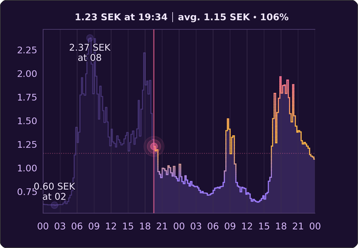
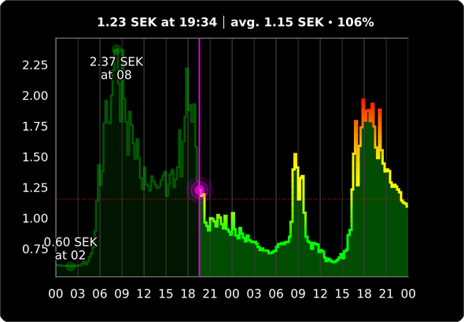
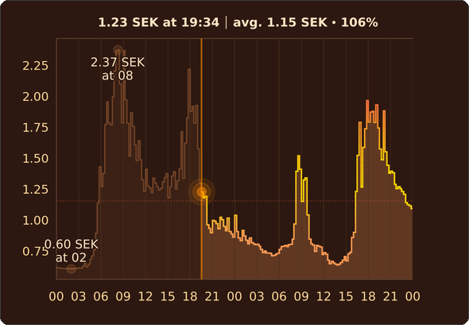
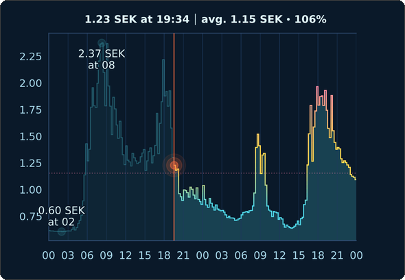
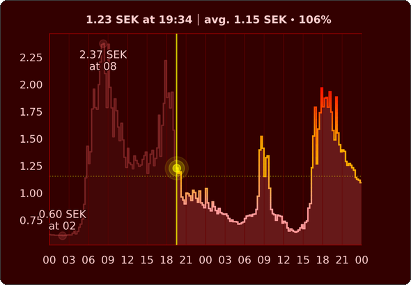

# Custom Theme Action

The `set_custom_theme` action allows you to dynamically set a custom color scheme for your Tibber Graph entity. This provides complete control over the visual appearance of your graph.

> [!TIP]
> Please do not hesitate to share your custom themes with the community by opening a pull request to get it added to the list of [built-in themes](/custom_components/tibber_graph/themes.json).

## Usage

See [README.md](/README.md#actions) for how to use.

## Theme Properties

All properties must be included when setting a custom theme:

| Property                     | Type    | Description                                | Example (`dark` theme) |
| ---------------------------- | ------- | ------------------------------------------ | ---------------------- |
| `axis_label_color`           | string  | Color for axis labels (hex)                | `"#cfd6e6"`            |
| `background_color`           | string  | Graph background color (hex)               | `"#1c1c1c"`            |
| `cheap_price_color`          | string  | Color for cheap price highlights (hex)     | `"#2d5a3d"`            |
| `fill_alpha`                 | float   | Opacity of the area fill (0.0-1.0)         | `0.18`                 |
| `fill_color`                 | string  | Color for area fill (hex)                  | `"#7dc3ff"`            |
| `grid_alpha`                 | float   | Opacity of grid lines (0.0-1.0)            | `0.45`                 |
| `grid_color`                 | string  | Color for grid lines (hex)                 | `"#2a2f36"`            |
| `label_color`                | string  | Color for price labels (hex)               | `"#e6edf3"`            |
| `label_color_avg`            | string  | Color for average price label (hex)        | `"#eab308"`            |
| `label_color_max`            | string  | Color for maximum price label (hex)        | `"#fb7185"`            |
| `label_color_min`            | string  | Color for minimum price label (hex)        | `"#34d399"`            |
| `label_stroke`               | boolean | Whether labels have an outline             | `true`                 |
| `nowline_alpha`              | float   | Opacity of the current time line (0.0-1.0) | `0.5`                  |
| `nowline_color`              | string  | Color for current time line (hex)          | `"#ff6b6b"`            |
| `plot_linewidth`             | float   | Width of the price line                    | `1.0`                  |
| `price_line_color`           | string  | Default price line color (hex)             | `"#7dc3ff"`            |
| `price_line_color_above_avg` | string  | Color when price is above average (hex)    | `"#fb7185"`            |
| `price_line_color_below_avg` | string  | Color when price is below average (hex)    | `"#7dc3ff"`            |
| `price_line_color_near_avg`  | string  | Color when price is near average (hex)     | `"#eab308"`            |
| `spine_color`                | string  | Color for chart border (hex)               | `"#3a4250"`            |
| `tick_color`                 | string  | Color for axis ticks (hex)                 | `"#cfd6e6"`            |
| `tickline_color`             | string  | Color for tick lines (hex)                 | `"#1f2530"`            |

## Examples

> [!TIP]
> Use `background_color: none` for transparent background.

### Themes

<details>
<summary>Purple Theme:</summary>



</details>

```yaml
action: tibber_graph.set_custom_theme
data:
  entity_id: camera.tibber_graph_nord_pool_price
  theme_config:
    axis_label_color: "#d8b9ff"
    background_color: "#1a0f2e"
    cheap_price_color: "#2d3d5a"
    fill_alpha: 0.2
    fill_color: "#9d7cff"
    grid_alpha: 0.4
    grid_color: "#3d2f50"
    label_color: "#f0e6ff"
    label_color_avg: "#ffb347"
    label_color_max: "#ff6b9d"
    label_color_min: "#7cffb3"
    label_stroke: true
    nowline_alpha: 0.6
    nowline_color: "#ff6b9d"
    plot_linewidth: 1.2
    price_line_color: "#9d7cff"
    price_line_color_above_avg: "#ff6b9d"
    price_line_color_below_avg: "#9d7cff"
    price_line_color_near_avg: "#ffb347"
    spine_color: "#503d70"
    tick_color: "#d8b9ff"
    tickline_color: "#2e1f45"
```

<details>
<summary>High-Contrast Dark Theme:</summary>



</details>

```yaml
action: tibber_graph.set_custom_theme
data:
  entity_id: camera.tibber_graph_nord_pool_price
  theme_config:
    axis_label_color: "#ffffff"
    background_color: "#000000"
    cheap_price_color: "#004d00"
    fill_alpha: 0.3
    fill_color: "#00ff00"
    grid_alpha: 0.6
    grid_color: "#404040"
    label_color: "#ffffff"
    label_color_avg: "#ffff00"
    label_color_max: "#ff0000"
    label_color_min: "#00ff00"
    label_stroke: true
    nowline_alpha: 0.8
    nowline_color: "#ff00ff"
    plot_linewidth: 2.0
    price_line_color: "#00ff00"
    price_line_color_above_avg: "#ff0000"
    price_line_color_below_avg: "#00ff00"
    price_line_color_near_avg: "#ffff00"
    spine_color: "#808080"
    tick_color: "#ffffff"
    tickline_color: "#404040"
```

<details>
<summary>Warm Amber Theme:</summary>



</details>

```yaml
action: tibber_graph.set_custom_theme
data:
  entity_id: camera.tibber_graph_nord_pool_price
  theme_config:
    axis_label_color: "#ffd89b"
    background_color: "#2c1810"
    cheap_price_color: "#4d3b1f"
    fill_alpha: 0.25
    fill_color: "#ff9a56"
    grid_alpha: 0.35
    grid_color: "#4d3020"
    label_color: "#ffe4c4"
    label_color_avg: "#ffd700"
    label_color_max: "#ff6347"
    label_color_min: "#98fb98"
    label_stroke: true
    nowline_alpha: 0.6
    nowline_color: "#ff8c00"
    plot_linewidth: 1.2
    price_line_color: "#ff9a56"
    price_line_color_above_avg: "#ff6347"
    price_line_color_below_avg: "#ff9a56"
    price_line_color_near_avg: "#ffd700"
    spine_color: "#5d4030"
    tick_color: "#ffd89b"
    tickline_color: "#3d2820"
```

<details>
<summary>Cool Blue-Green Theme:</summary>



</details>

```yaml
action: tibber_graph.set_custom_theme
data:
  entity_id: camera.tibber_graph_nord_pool_price
  theme_config:
    axis_label_color: "#a8d8ea"
    background_color: "#0a1929"
    cheap_price_color: "#1a4d4d"
    fill_alpha: 0.22
    fill_color: "#4dd0e1"
    grid_alpha: 0.4
    grid_color: "#1e3a5f"
    label_color: "#e0f7fa"
    label_color_avg: "#ffd54f"
    label_color_max: "#ff80ab"
    label_color_min: "#69f0ae"
    label_stroke: true
    nowline_alpha: 0.55
    nowline_color: "#ff6e40"
    plot_linewidth: 1.1
    price_line_color: "#4dd0e1"
    price_line_color_above_avg: "#ff80ab"
    price_line_color_below_avg: "#4dd0e1"
    price_line_color_near_avg: "#ffd54f"
    spine_color: "#2e4a6f"
    tick_color: "#a8d8ea"
    tickline_color: "#152a3f"
```

### Automations

#### Dynamic Theme Based on Price

<details>
<summary>Change theme colors when electricity prices are high:</summary>



</details>

```yaml
automation:
  - alias: "Tibber Graph - Red Theme When Expensive"
    trigger:
      - platform: numeric_state
        entity_id: sensor.electricity_price_now
        above: 2.0
    action:
      - action: tibber_graph.set_custom_theme
        data:
          entity_id: camera.tibber_graph_nord_pool_price
          theme_config:
            axis_label_color: "#ffcccc"
            background_color: "#330000"
            cheap_price_color: "#660000"
            fill_alpha: 0.25
            fill_color: "#ff6666"
            grid_alpha: 0.4
            grid_color: "#660000"
            label_color: "#ffcccc"
            label_color_avg: "#ffaa00"
            label_color_max: "#ff0000"
            label_color_min: "#66ff66"
            label_stroke: true
            nowline_alpha: 0.7
            nowline_color: "#ffff00"
            plot_linewidth: 1.5
            price_line_color: "#ff6666"
            price_line_color_above_avg: "#ff0000"
            price_line_color_below_avg: "#ff9999"
            price_line_color_near_avg: "#ffaa00"
            spine_color: "#990000"
            tick_color: "#ffcccc"
            tickline_color: "#440000"

  - alias: "Tibber Graph - Revert When Normal"
    trigger:
      - platform: numeric_state
        entity_id: sensor.electricity_price_now
        below: 2.0
    action:
      - action: tibber_graph.set_custom_theme
        data:
          entity_id: camera.tibber_graph_nord_pool_price
```

#### Night Mode

```yaml
automation:
  - alias: "Tibber Graph Night Theme"
    trigger:
      - platform: time
        at: "20:00:00"
    action:
      - action: tibber_graph.set_custom_theme
        data:
          entity_id: camera.tibber_graph_nord_pool_price
          theme_config:
            # Your custom night theme colors here
            background_color: "#000000"
            # ... (all other required fields)

  - alias: "Tibber Graph Day Theme"
    trigger:
      - platform: time
        at: "06:00:00"
    action:
      - action: tibber_graph.set_custom_theme
        data:
          entity_id: camera.tibber_graph_nord_pool_price
          # Clear custom theme to use configured theme
```

## Notes

- The custom theme takes precedence over the configured theme option
- After setting or clearing a custom theme, the entity is automatically reloaded
- If any required field is missing, the action call will fail
- The custom theme is stored in the entity's configuration and persists across Home Assistant restarts
